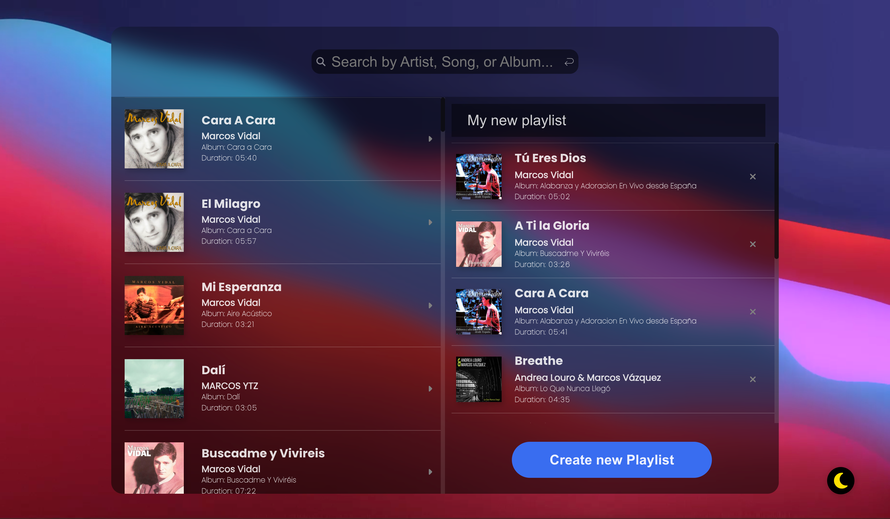

# &nbsp; Jammming &nbsp; 

 

    

 

Jamming is a React project developed by students in Codecademy’s Full Stack course. It’s a playlist creator that utilizes Spotify’s search API, allowing you to quickly create playlists directly from your browser.

Link to live project: <a href="https://jonarhood.netlify.app">https://jonarhood.netlify.app</a> 
 
<i><strong>Note:</strong> You cannot create playlists due to Spotify's API Development Mode restrictions, but you can explore the app's UI and functionality.</i>

(<a href="#readme-top">back to top</a>)

## 📋 &nbsp; Table of Contents

1. [Introduction](#introduction)
2. [Features](#features)
3. [Technologies Used](#technologies-used)
4. [Contact](#contact)

(<a href="#readme-top">back to top</a>)

## ✏️ &nbsp; Introduction

Jamming is currently in development mode with the Spotify API. As a result, to use it with Spotify users, the project author must manually enter each user's email address in the Dashboard at [Spotify Developer Dashboard](https://developer.spotify.com/). 

However, you can still access and test the app’s functionality and user interface without issues. Please note that visitors will not be able to create new playlists during this development phase.

(<a href="#readme-top">back to top</a>)

## 💿 &nbsp; Features

- Spotify user authentication on app startup
- Automatic Spotify token generation every 3,600,000 ms
- Spotify API integration for search functionality
- Library displaying search results
- Dedicated space for playlist creation
- Input field to name the new playlist
- utton to create the new playlist

(<a href="#readme-top">back to top</a>)

## ⚙️ &nbsp; Technologies Used

* [![REACT][REACT.js]][REACT-url]
* [![JAVASCRIPT][JAVASCRIPT.js]][JAVASCRIPT-url]
* [![CSS][CSS.js]][CSS-url]
* [![HTML5][HTML5.js]][HTML5-url]
* [![GIT][GIT.js]][GIT-url]

(<a href="#readme-top">back to top</a>)

## 🎫 &nbsp; Contact

Jonathan Cano -  jonathancanofreta@gmail.com
 
[![LinkedIn][linkedin-shield]][linkedin-url]

(<a href="#readme-top">back to top</a>)

[product-screenshot]: ./src/resources/img/screen2.png
[linkedin-shield]: https://img.shields.io/badge/-LinkedIn-blue.svg?style=for-the-badge&logo=linkedin&colorBlue
[linkedin-url]: https://www.linkedin.com/in/jonathancanocalduch
[React.js]: https://img.shields.io/badge/React-20232A?style=for-the-badge&logo=react&logoColor=61DAFB
[React-url]: https://reactjs.org/
[Javascript.js]: https://img.shields.io/badge/Javascript-3b473e?style=for-the-badge&logo=JavaScript&logoColor=Y
[Javascript-url]: https://developer.mozilla.org/es/docs/Web/JavaScript
[CSS.js]: https://img.shields.io/badge/CSS3-001569?style=for-the-badge&logo=css3&logoColor=306af1
[CSS-url]: https://developer.mozilla.org/es/docs/Web/CSS
[HTML5.js]: https://img.shields.io/badge/HTML5-2d1f09?style=for-the-badge&logo=html5&logoColor=e8571f
[HTML5-url]: https://developer.mozilla.org/es/docs/Glossary/HTML5
[Git.js]: https://img.shields.io/badge/git-002c05?style=for-the-badge&logo=git&logoColor=e8571f
[Git-url]: https://git-scm.com/
